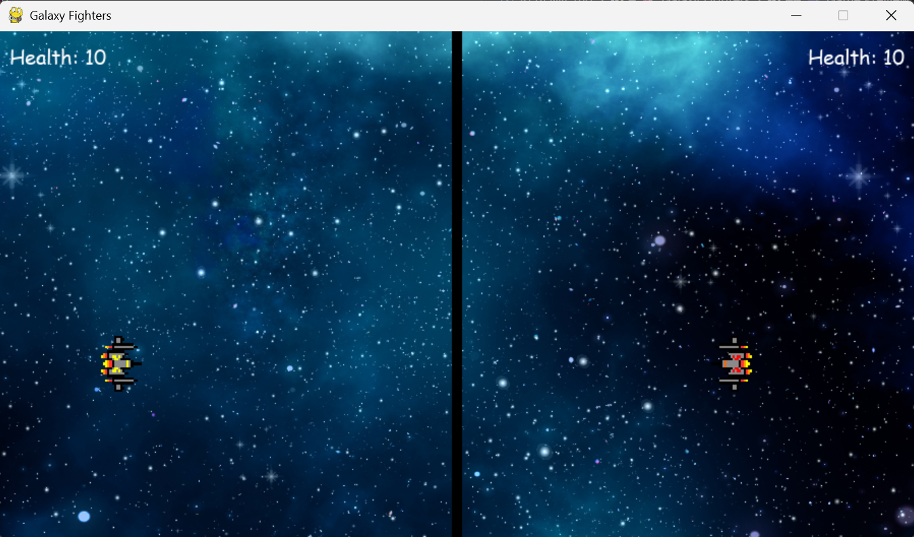

# 🚀 Galaxy Fighters

A fun **2-player local multiplayer** spaceship battle game built with **Python** and **Pygame**.

Two players face off across a divided battlefield. Dodge enemy fire, shoot accurately, and reduce your opponent’s health to zero to claim victory!

---

## 🎮 Game Preview

<!-- 
  Add your game screenshot here.
  Example:
  
  
  Or drag & drop an image into this README on GitHub.
-->

**[Insert Game Screenshot Here]**

*(Recommended size: 900×500 or similar aspect ratio)*

---

## ✨ Features

- Clean main menu
- Modern health bars (instead of just numbers)
- Restart after match (`R` key)
- Proper quit support (`ESC`)
- Volume-controlled sound effects
- Smooth 60 FPS gameplay
- Beginner-friendly code structure
- Fixed original bugs (missing colon, recursive restart, etc.)

---

## 🕹️ Controls

| Player            | Movement          | Shoot       |
|-------------------|-------------------|-------------|
| **Yellow** (Left) | `W` `A` `S` `D`   | `Left Ctrl` |
| **Red** (Right)   | `↑` `←` `↓` `→`   | `Right Ctrl` |

- Max **3 bullets** on screen per player
- Ships cannot cross the center border

**Menu:**  
- `SPACE` → Start game  
- `ESC` → Quit  

**After match:**  
- `R` → Restart  
- `ESC` → Quit  

---

## 📦 Requirements

- Python 3.8+
- Pygame

```bash
pip install pygame
```

---

## 🚀 How to Run

```bash
git clone https://github.com/Souravbanerjeedata/galaxy-fighters-python-game.git
cd galaxy-fighters-python-game
pip install pygame
python main.py
```

---

## 📁 Project Structure

```
galaxy-fighters-python-game/
├── Assets/
│   ├── hit.mp3                 # Hit sound
│   ├── shoot.mp3               # Shoot sound
│   ├── space.png               # Background
│   ├── spaceship_red.png
│   └── spaceship_yellow.png
├── main.py                     # Improved game code
└── README.md
```

> **Note:** Sound files were renamed from the original (`Grenade+1.mp3` → `hit.mp3`, `Gun+Silencer.mp3` → `shoot.mp3`) for better compatibility.

---

## 🛠️ Improvements Made

| Original Issue                  | Fixed / Improved                     |
|--------------------------------|--------------------------------------|
| Missing `:` in function        | Fixed                                |
| Recursive `main()` call        | Proper loop + restart                |
| No menu                        | Added main menu                      |
| Plain health numbers           | Visual health bars                   |
| No restart option              | Press `R` to play again              |
| Hard-coded paths               | Relative paths using `__file__`      |
| No volume control              | Sound volumes adjusted               |
| List modification while iterating | Safe `[:]` copy used               |

---

## 💡 Future Ideas

- Power-ups (shield, rapid fire, health pack)
- Particle explosions
- Background music
- Score / win streak counter
- AI opponent
- Different ship skins

---

## 📄 License

Open source – feel free to use, modify and share.

---

**Made with ❤️ by Sourav Banerjee**  
⭐ Star the repo if you like it!
